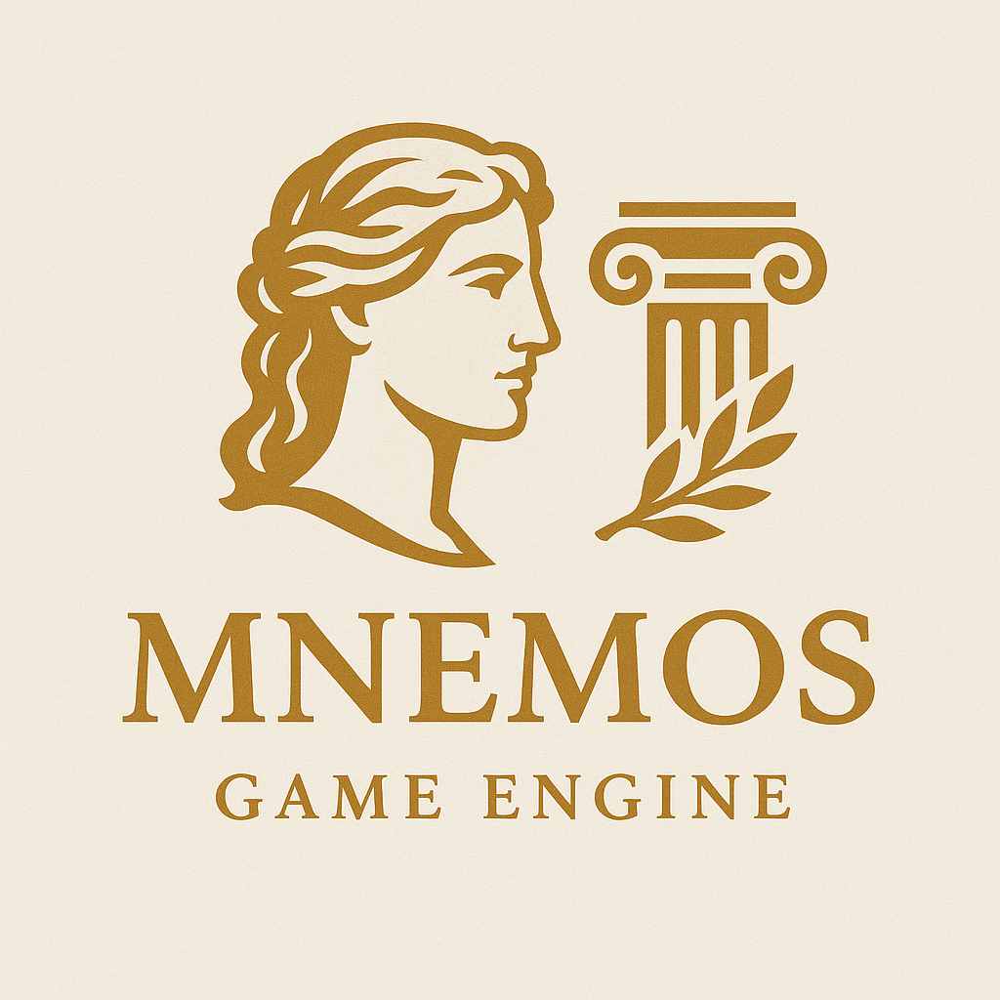

# Mnemos Evolved

This project exists because I wanted to learn how a modern game engine works behind the hood. I want to keep external dependencies at a minimum, no SDL/glfw-like libraries are used. Almost everything is done from scratch using C++ 20.




## Features

- Minimal external dependencies — pure C++ and system APIs
- Cross-platform support: Windows, Linux
- Built with CMake using `CMakePresets.json`
- Low-level rendering (OpenGL, will add Vulkan/DX12 later)
- Modular design with extensibility in mind

### List of features (WIP)
- [x] CMake cross-platform project structure
- [ ] Engine subsystems
    - [x] Logging
        - [x] Levels
        - [x] Channels
        - [x] Timestamp
    - [x] Game loop
        - [x] Fixed timestep update
        - [x] Variable timestep update
    - [ ] Windowing
        - [ ] Window abstraction
        - [ ] Event handling
        - [ ] OpenGL context
    - [ ] Input
        - [ ] Keycodes abstraction
        - [ ] Key state
    - [ ] Events
        - [ ] Event creation
        - [ ] Event callback
    - [ ] Renderer
        - [ ] Renderer API abstraction
        - [ ] Mesh rendering
        - [ ] Material system
        - [ ] Camera (projection, orthogonal)
        - [ ] Rendering model (Phong, PBR)
        - [ ] Deferred renderer
        - [ ] Post processing
    - [ ] ECS
        - [ ] Entity
        - [ ] Components
        - [ ] Scene system
        - [ ] Entity hierarchy
    - [ ] Resource Manager
        - [ ] File parsers (OBJ, FBX, GLTF, BMP, JPG, PNG)
        - [ ] Asset caching
    - [ ] Editor
        - [ ] User Interface
        - [ ] Scene tree panel
        - [ ] Inspector (entities, components)
        - [ ] Asset browser
        - [ ] Profiler
    - [ ] Physics
        - [ ] Colliders
        - [ ] Rigidbodies
        - [ ] Raycasting
    - [ ] Audio
- [x] Application lifecycle management

## Build Instructions

### Clone the Repository

```bash
git clone git@github.com:OlivierGisselmann/mnemos-evolved
cd mnemos-evolved
```

### Build with CMake Presets

Make sure you have CMake ≥ 3.25:

```bash
cmake --list-presets
cmake --preset debug-linux     # or release-linux, debug-windows etc.
cmake --build --preset app-debug-linux
```

## Project Structure

```
CrossPlatEngine/
├── application/         # Application source files
├── engine/              # Engine sources
├── include/             # Public headers
├── vendor/              # External dependencies
├── CMakeLists.txt       # Root CMake config
├── CMakePresets.json    # Build presets
└── README.md
```

## Running the Engine

After building, the engine executable will be in the preset-specific `out/{preset}` directory:

```bash
./out/debug-linux/application/Application
# OR
.\out\debug-windows\application\Application.exe
```

## Dependencies

I want to keep this project with minimal dependencies. For now, the only external libraries used are OS-specific APIs (e.g. window system).

## Contributing

Contributions are welcome! Open an issue for discussion before submitting large changes.

## License

GNU General Public License. See `LICENSE` for details.

## Credits

Here is a list of useful resources I used for this project:

- Game Engine Architecture - Third Edition by Jason Gregory
- Game Programming Patterns - Robert Nystrom
- Kohi Game Engine series by Travis Vroman